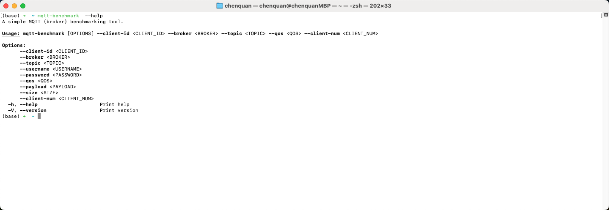

# mqtt-benchmark

A simple MQTT (broker) benchmarking tool.

## Usage

```shell
cargo install mqtt-benchmark
```

## Help
```text
$ mqtt-benchmark  --help
A simple MQTT (broker) benchmarking tool.

Usage: mqtt-benchmark [OPTIONS] --client-id <CLIENT_ID> --broker <BROKER> --topic <TOPIC> --qos <QOS> --client-num <CLIENT_NUM>

Options:
      --client-id <CLIENT_ID>    
      --broker <BROKER>          
      --topic <TOPIC>            
      --username <USERNAME>      
      --password <PASSWORD>      
      --qos <QOS>                
      --payload <PAYLOAD>        
      --size <SIZE>              
      --client-num <CLIENT_NUM>  
  -h, --help                     Print help
  -V, --version                  Print version
```


